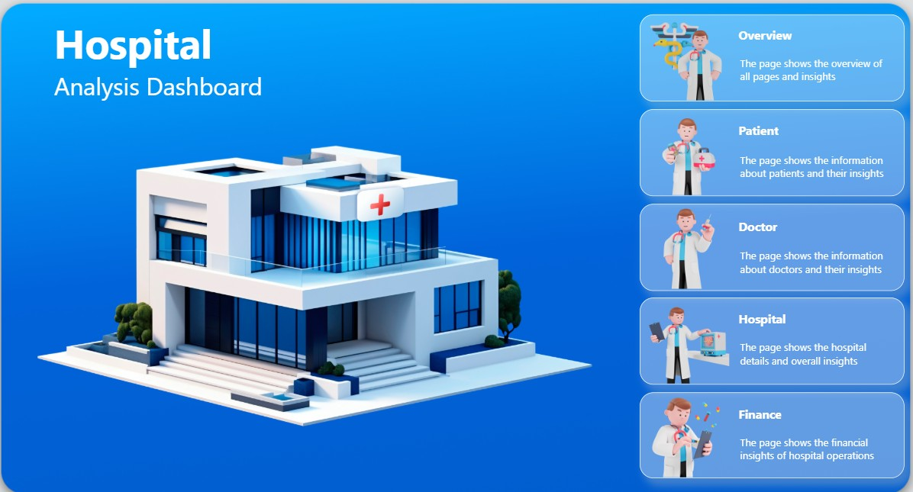
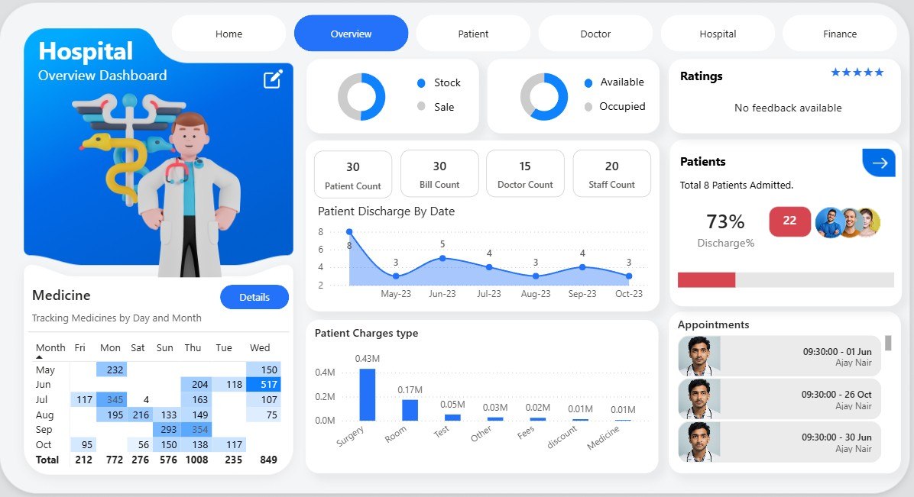
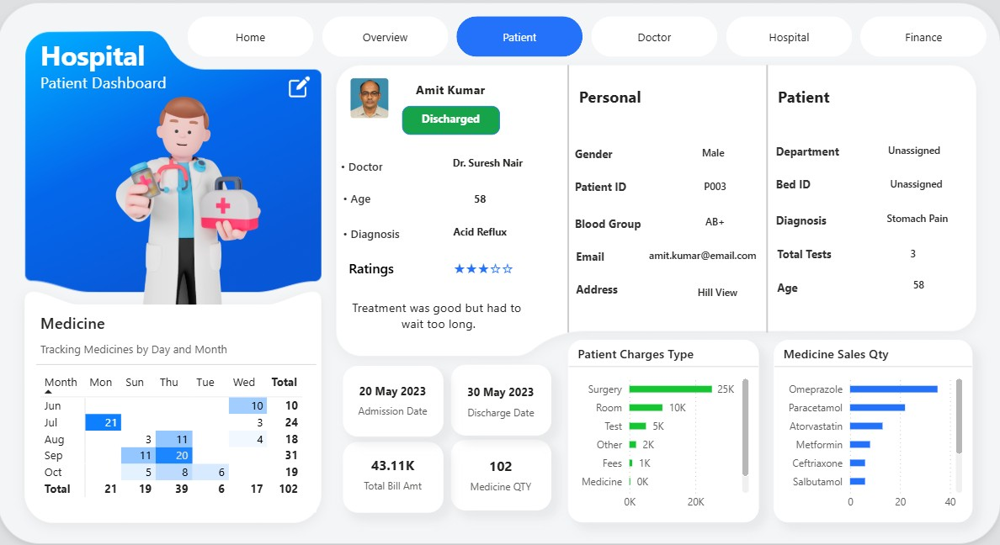
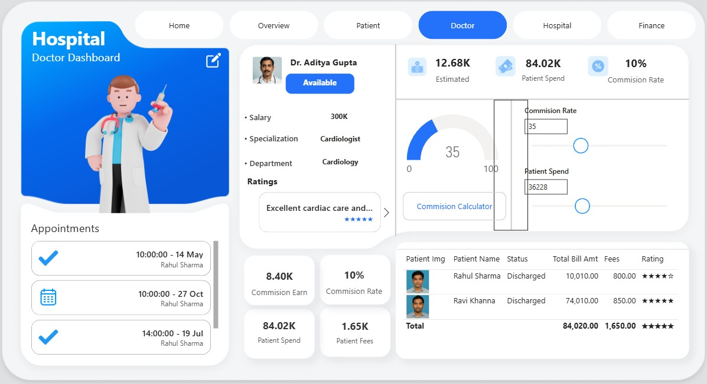
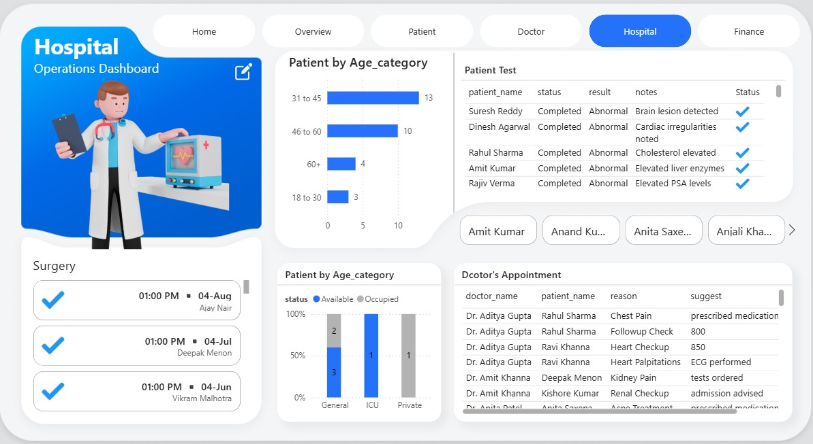
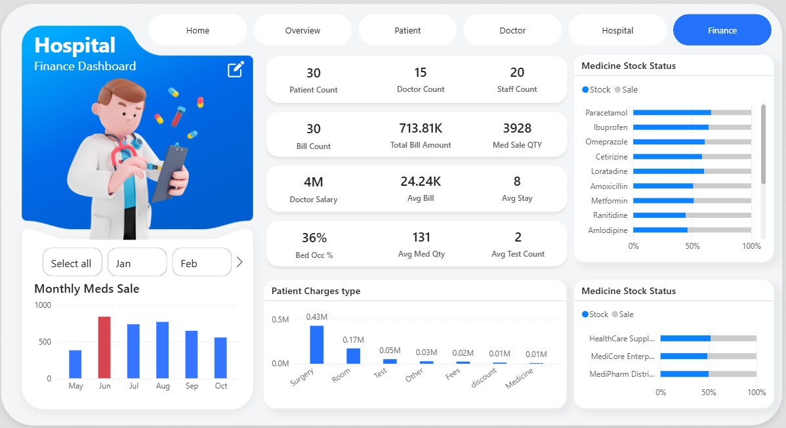

# 🏥 Hospital Analytics Dashboard

A multi-page **Power BI dashboard** designed to analyze hospital operations, patient data, doctor performance, and financial insights.

---

## 🚀 Project Overview

This project delivers an end-to-end analytical view of a hospital system. It combines structured data with interactive visualizations to provide meaningful insights across different domains:

- Patient analysis (demographics, diagnosis, stay details)
- Doctor performance and commission insights
- Hospital operations (beds, departments, tests)
- Financial analytics (billing, revenue, expenses)

---

## 🛠️ Tech Stack

- **Power BI** – Dashboard development & visualization  
- **DAX** – KPI calculations and measures  
- **MySQL** – Data handling and transformation  
- **Excel** – Raw dataset  

---

## ✨ Key Features

- 📊 6 interactive dashboard pages  
- 📈 Dynamic KPIs (Avg Stay, Med/Patient, Bed Occupancy %)  
- 🎯 Interactive filtering (Patient & Doctor selection)  
- 🧠 Insight-driven visuals for decision-making  
- 🎨 Clean and consistent UI design  
- ⚡ Handles missing/null values effectively  

---

## 🖼️ Dashboard Screens

### 🏠 Home

### 📊 Overview

### 👤 Patient

### 👨‍⚕️ Doctor

### 🏥 Hospital

### 💰 Finance

---

## 📊 Key KPIs

- **Patient Count**  
- **Doctor Count**  
- **Total Bill Amount**  
- **Average Stay Duration**  
- **Medicine per Patient**  
- **Bed Occupancy %**  
- **Doctor Commission**  
- **Patient Spend**  

---

## 📂 Data Processing

The project follows a structured data workflow:

1. Raw datasets were collected and organized in Excel  
2. Data was processed and transformed using MySQL  
3. Additional modeling and calculations were performed in Power BI using DAX  
4. Final insights were visualized through interactive dashboards  

---

## 📁 Dataset

The dataset used in this project is included in the `data/` folder.

> Note: This is a sample dataset created for learning and demonstration purposes.

---

## 🎥 Demo Video

*(Will be added soon)*

---

## 🧠 Learnings

- Built a complete multi-page BI solution  
- Applied DAX for real-world KPI calculations  
- Integrated SQL with Power BI workflow  
- Improved UI/UX for better user experience  
- Handled missing and inconsistent data  

---

## 📬 Contact

If you'd like to connect or discuss this project:

- 🔗 LinkedIn: https://www.linkedin.com/in/aditya-verma-aa8178288/  
- 📧 Email: adityaverma5069@gmail.com  
